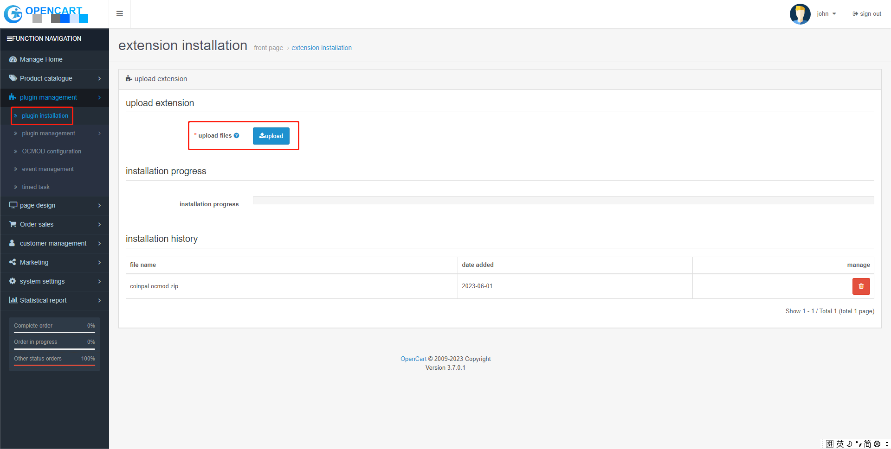
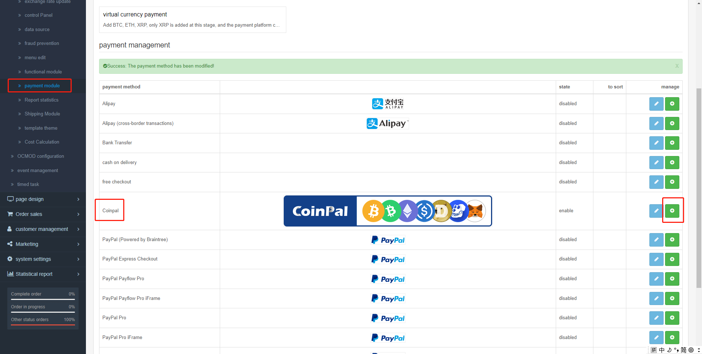
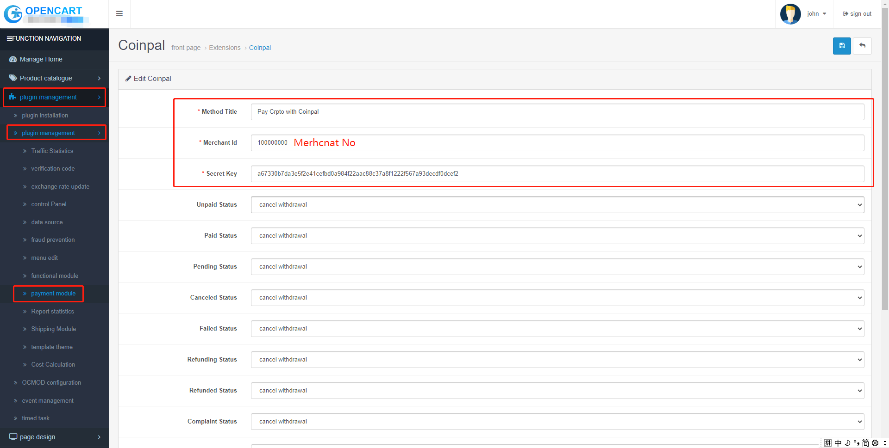
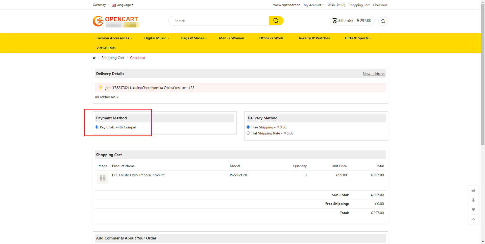

# OpenCart Coinpal Checkout Installation

## Step 1: Login Coinpal Admin Dashboard get Merchant No and Secret Key.
1. [Register](https://portal.coinpal.io/#/admin/register)/[login](https://portal.coinpal.io/#/admin/login) and go to Coinpal's Admin Dashboard 


2. Follow the Dashboard guidelines to fill in the relevant information

3. Click the 'Integration' button in the lower left corner to get the corresponding Merchant Id and Secret Key


## Step 2: Installing the Coinpal Plugin on your OpenCart Site.
1. Click the  [Coinpal plug](https://github.com/CoinpalGroup/plug_opencart/blob/master/coinpal.ocmod.zip)  Download Coinpal OpenCart Payment Plug

1. Upload module content to the path below magento :  /magento/app/code/

2. In command line, navigate to the magento root folder
Enter the following commands:

```
php bin/magento module:enable Coinpal_Checkout --clear-static-content
php bin/magento setup:upgrade
```


2. Go to your OpenCart admin area and click on plugins management -> plugins installation -> upload

3. Activate the Coinpal OpenCart Gateway

    Go to your OpenCart admin area and click on plugins management -> plugins management -> payment module

    Find the payment method Coinpal, click install




Copy and Paste all of the Settings you generated in your Coinpal Dashboard on Step #1.

Click Save Changes.


## Step 3: Testing your Coinpal WooCommerce Integration.

To confirm your Integration is properly working create a test order:

Add Test Item to Shopping Cart and View Cart.

Proceed to Checkout

Select Pay Crpto with Coinpal as the Payment Method.

Click Confirm Order


Click the “Confirm Order” button.


Verify all of the Wallet Addresses and Order info, and make sure the Validation Tests all have a Green Check Mark.

If you like you can now proceed to making a test payment.


## Step 4: Marking a Payment as Received on OpenCart.

Login to your OpenCart Admin Dashboard.

Go to the OpenCart Section and Click Orders.

You will see the Test Orders Marked as “Paid”

Verify the Coins are in your chosen Coinpal Wallet (The addresses you input in Step #1.)

You may also use a Block Explorer to verify if the transaction was processed.

After the verification of the above steps is completed, it means that the connection with Coinpal is successful.


